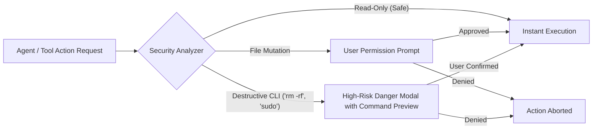

<div align="center">


# Kernel Base

### **Linux-First AI-Native Multi-Agent Integrated Development Environment**

*Next-generation intelligent IDE pairing developers with an autonomous multi-agent swarm in a high-performance Linux desktop environment.*

<br />

[](https://kernel.org)
[](https://electronjs.org)
[](https://react.dev)
[](https://www.typescriptlang.org)
[](https://microsoft.github.io/monaco-editor/)
[](https://tailwindcss.com)
[](LICENSE)

<br />

[Architecture Spec](docs/architecture/linux-electron-architecture.md) • [Features](#-key-features) • [Tech Stack](#-technology-stack) • [System Architecture](#-system-architecture) • [AI Agent Swarm](#-autonomous-multi-agent-swarm) • [Security & Permissions](#-zero-trust-security-engine) • [Quick Start](#-quick-start--development)

</div>

---

## 🌟 Highlights & Overview

**Kernel Base** is a Linux-first, AI-native desktop IDE. Unlike traditional code editors that treat AI as a sidecar chatbot, Kernel Base is an **AI execution platform inside a desktop IDE**, powered by a multi-agent swarm, provider-agnostic Model Gateway (supporting Ollama, Hugging Face, llama.cpp, and Cloud LLMs), Linux sandboxing (bubblewrap/cgroups), SQLite local state, and dedicated Report Workspaces.

For the detailed architectural specification, please read the [Linux Desktop Application Architecture Document](docs/architecture/linux-electron-architecture.md).

---

## 🛠️ Technology Stack

Kernel Base is engineered with a modular, highly performant stack uniting modern web UI standards with native macOS OS integrations:

```
┌─────────────────────────────────────────────────────────────────────────────┐
│                             KERNEL BASE IDE                                 │
├──────────────────────┬──────────────────────┬───────────────────────────────┤
│  Frontend & Editor   │    AI & Multi-Agent  │    Desktop & Native Runtime   │
│  ──────────────────  │    ────────────────  │    ────────────────────────   │
│  • React 19          │  • Google GenAI SDK  │  • Electron 34                │
│  • Monaco Editor     │  • DAG Task Planner  │  • macOS Keychain Bridge      │
│  • Tailwind CSS v4   │  • Multi-Agent Swarm │  • Traffic Light Window IPC   │
│  • xterm.js & Addons │  • Tool Exec Engine  │  • Native Node PTY & zsh      │
│  • Framer Motion     │  • Context Manager   │  • Git Porcelain Subsystem    │
└──────────────────────┴──────────────────────┴───────────────────────────────┘
```

### Detailed Stack Breakdown

| Layer | Technologies | Description |
| :--- | :--- | :--- |
| **Desktop Shell & Native** | **Electron 34**, **Node.js 22**, **Apple Silicon (`arm64`)** | Native macOS frameless window with traffic lights, menu bar items, entitlements, and Keychain security. |
| **UI Framework & Design** | **React 19**, **Tailwind CSS 4**, **Framer Motion**, **Lucide Icons** | Ultra-responsive IDE interface with custom warm ember dark theme (`#752c12` / `#a64011`). |
| **Code Editor Core** | **Monaco Editor 0.52**, `@monaco-editor/react` | Industrial-grade code editing, multi-language syntax highlighting, line decorations, and diagnostics. |
| **Terminal & Shell** | **xterm.js 5.5**, `@xterm/addon-fit`, `@xterm/addon-web-links` | Hardware-accelerated terminal emulator connected directly to native `/bin/zsh`. |
| **AI Intelligence** | **Google GenAI SDK (`@google/genai`)**, Claude, OpenAI, Ollama | Multi-provider streaming AI runtime with tool invocation and multi-step reasoning. |
| **Diff & Inspection** | **`diff`**, Side-by-Side Unified Diff Inspector | Visual chunk-by-chunk diff inspection with granular Accept/Reject capabilities. |
| **Build & Tooling** | **Vite 6 / 8**, **TypeScript 5**, **Esbuild**, **Electron Forge** | Instant hot-reloading in dev and optimized production DMG bundling. |

---

## 🚀 Key Features

- 🖥️ **Native macOS Experience**: Polished frameless interface with traffic light window controls, native system menus, dark theme, and Apple Silicon hardware acceleration.
- 🤖 **Autonomous Multi-Agent Swarm**: 7 collaborative AI agents coordinating via DAG task execution with live streaming thought traces.
- 📝 **Monaco Code Editor**: Full-featured VS Code-grade editing with tabbed navigation, dirty state tracking, and keyboard shortcuts.
- ⚡ **Embedded Native Terminal**: Multi-tab xterm.js terminal with direct shell streaming, fit addon, and interactive shell execution.
- 🌿 **Git Version Control Panel**: Visual Git porcelain manager for staging, unstaging, viewing diffs, switching branches, committing, and pushing.
- 🔍 **Interactive Diff Reviewer**: Inspect agent proposals side-by-side with one-click Accept / Reject diff actions before disk mutation.
- 🛡️ **Zero-Trust Security Gate**: Real-time permission gatekeeper intercepting destructive bash commands (`rm -rf`, `sudo`, `dd`) and unauthorized file operations.
- 🔑 **macOS Keychain Key Storage**: Secure hardware-level storage for LLM API keys.

---

## 🏗️ System Architecture

```mermaid
flowchart TD
    subgraph macOSHost["macOS Desktop Operating System"]
        subgraph ElectronRenderer["Renderer Process (React 19 + Monaco + xterm.js)"]
            UI["Activity Bar & Title Bar Controls"]
            Editor["Monaco Code Editor Core"]
            AgentsUI["Agent Swarm & Live Reasoning"]
            GitUI["Git Staging & Branch Manager"]
            TerminalUI["xterm.js Native Terminal"]
            DiffUI["Side-by-Side Diff Inspector"]
        end

        subgraph SecureBridge["IPC Context Bridge (window.kernelBase)"]
            Bridge["Type-Safe Bidirectional IPC Layer"]
        end

        subgraph ElectronMain["Electron Main Process (Node.js 22 Runtime)"]
            AgentRuntime["Multi-Agent Swarm Orchestrator"]
            ToolEngine["Tool Execution Sandbox"]
            PermBroker["Zero-Trust Permission Broker"]
            PTYEngine["PTY / Shell Stream Process"]
            GitCLI["Git Porcelain Engine"]
            KeychainSec["macOS Keychain Security"]
        end
    end

    ElectronRenderer <--> SecureBridge
    SecureBridge <--> ElectronMain
```



---

## 🤖 Autonomous Multi-Agent Swarm

Kernel Base features 7 specialized autonomous AI agents operating as an integrated swarm:

| Agent | Icon | Role & Responsibilities | Core Capabilities |
| :--- | :---: | :--- | :--- |
| **Orchestrator** | 🧠 | Coordinates overall user intent, delegates work, and balances swarm tasks | Task Graph Dispatch, Swarm Load Balancing |
| **Planner** | 📐 | Deconstructs complex feature requests into dependency-mapped DAGs | Dependency Resolution, Execution Planning |
| **Coder** | 💻 | Writes clean, modular code, refactors components, and generates diffs | AST Analysis, Multi-file Code Generation |
| **Tester** | 🧪 | Runs test suites (`vitest`, `jest`, `pytest`, `cargo test`) and validates fixes | Automated Test Synthesis, Suite Execution |
| **Reviewer** | 👁️ | Audits code quality, type safety, performance, and security practices | Linting, Static Security Analysis, PR Review |
| **Researcher** | 🔍 | Indexes codebase, retrieves API docs, and finds patterns across files | Semantic Code Search, Indexing, Web Retrieval |
| **Debugger** | 🩺 | Analyzes runtime exceptions, stack traces, and produces surgical patches | Root Cause Isolation, Patch Verification |

---

## 🛡️ Zero-Trust Security Engine



- **Auto-Approved Safe Actions**: Read-only queries (`readFile`, `searchFiles`, `gitStatus`) execute without interruption.
- **Permission Confirmation**: File writes and deletions require interactive user confirmation.
- **Dangerous Command Interception**: High-risk commands (`rm -rf`, `sudo`, `mkfs`, raw curl pipelines) trigger prominent risk alerts detailing the danger severity.

---

## ⌨️ Keyboard Shortcuts

| Shortcut | Action |
| :--- | :--- |
| `Cmd + P` | Quick Open (Fuzzy file search) |
| `Cmd + Shift + P` | Command Palette |
| `Cmd + Shift + F` | Global Search across project |
| `Cmd + S` | Save active file |
| `Cmd + B` | Toggle Primary Sidebar |
| `Cmd + J` | Toggle Bottom Terminal / Output Panel |
| `Cmd + \` | Open Diff Viewer |
| `Cmd + ,` | Settings & AI Model Preferences |

---

## 🚀 Quick Start & Development

### Prerequisites

- **macOS Sonoma 14+** or **macOS Sequoia 15+** (Apple Silicon or Intel)
- **Node.js v20+ / v22+**
- **pnpm** (or `npm`)

### 1. Clone the Repository

```bash
git clone https://github.com/Sujoymoulick/KERNELBASE.git
cd KERNELBASE
```

### 2. Install Dependencies

```bash
npm install
# or
pnpm install
```

### 3. Run Development Environment

Starts the Vite renderer on port 3000 and launches the Electron desktop application with hot-reloading:

```bash
npm run dev
```

---

## 📦 macOS Build & Packaging

### Build Main & Renderer Bundles

```bash
npm run build
```

### Package macOS `.app` and Distributable `.dmg`

```bash
# Package for Apple Silicon (darwin-arm64)
npm run make:mac

# Or run full Electron Forge make suite
npm run make
```

### Output Artifacts

- **macOS Application**: `out/Kernel Base-darwin-arm64/Kernel Base.app`
- **DMG Installer**: `out/make/Kernel-Base-IDE-0.1.0.dmg`

---

## 📁 Repository Structure

```
.
├── public/                # Static assets, app icons, and logos
│   └── logo.png           # Official Kernel Base logo
├── electron/              # Electron main process & IPC handlers
│   ├── main.ts            # Main process lifecycle, window creation
│   └── preload.ts         # Secure context bridge definition
├── src/
│   ├── agents/            # Multi-agent swarm UI & reasoning stream
│   ├── app/               # App layout, header, titlebar, status bar
│   ├── context/           # React state contexts (IDE, Agent, Terminal)
│   ├── editor/            # Monaco editor & tab manager
│   ├── explorer/          # Workspace file tree & project explorer
│   ├── terminal/          # xterm.js terminal emulator panel
│   ├── diff/              # Side-by-side diff viewer & inspector
│   └── types/             # TypeScript definitions & IPC interfaces
├── scripts/               # Build scripts & validation runners
├── forge.config.cjs       # Electron Forge configuration (DMG & Zip)
├── package.json           # Project manifest and scripts
└── tsconfig.json          # TypeScript compiler configuration
```

---

## 📄 License

Distributed under the **Apache License 2.0**. See [`LICENSE`](LICENSE) for more details.

---

<div align="center">
  <sub>Built with precision for macOS developers by the Kernel Base Team.</sub>
</div>
